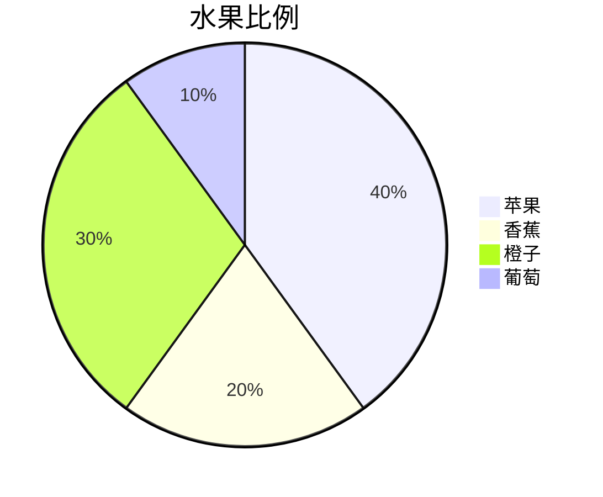
```mermaid
pie
    title 水果比例
    "苹果": 40
    "香蕉": 20
    "橙子": 30
    "葡萄": 10
```

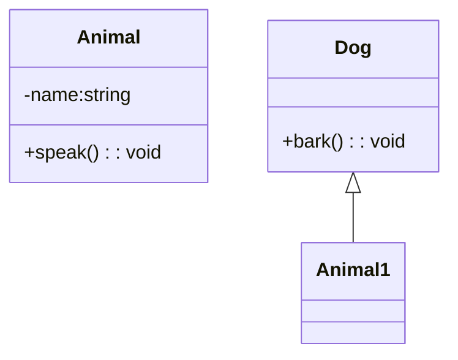
```mermaid
classDiagram
    class Animal {
        -name:string
        +speak(): void
    }
    class Dog {
        +bark(): void
    }
    Dog <|-- Animal1
```

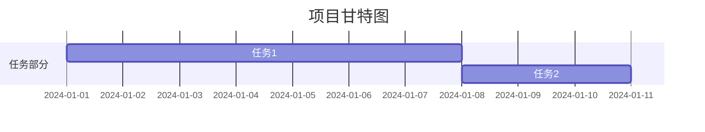
```mermaid
gantt
    dateFormat  YYYY-MM-DD
    title 项目甘特图
    section 任务部分
    任务1           :a1, 2024-01-01, 7d
    任务2           :after a1, 3d
```

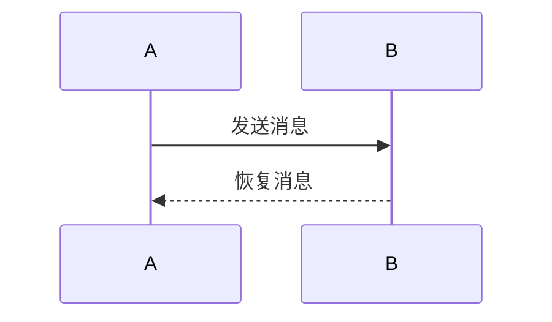
```mermaid
sequenceDiagram
    participant A
    participant B
    A->>B: 发送消息
    B-->>A: 恢复消息
```

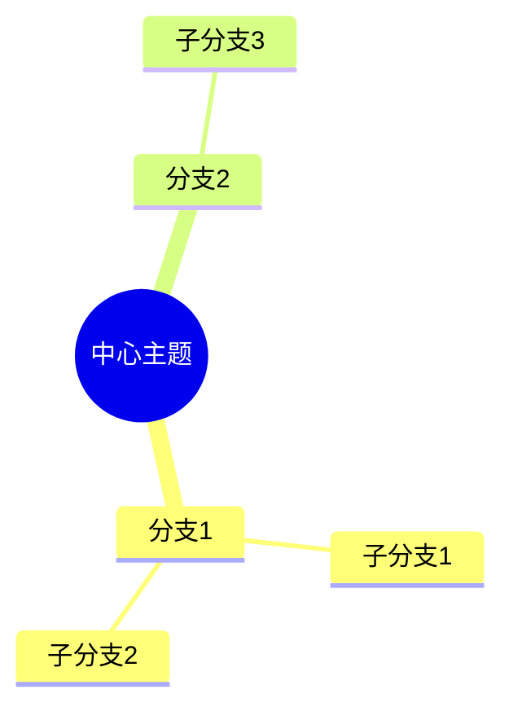
```mermaid
mindmap
    root((中心主题))
        分支1
            子分支1
            子分支2
        分支2
            子分支3
```

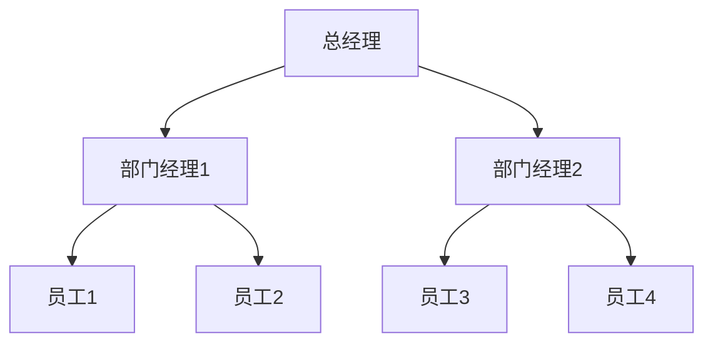
```mermaid
graph TD
    A[总经理] --> B[部门经理1]
    A --> C[部门经理2]
    B --> D[员工1]
    B --> E[员工2]
    C --> F[员工3]
    C --> G[员工4]
```

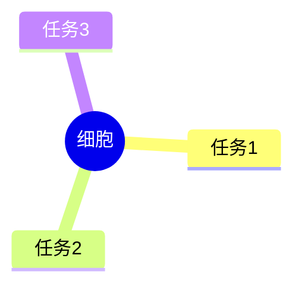
```mermaid
mindmap
    root((细胞))
        任务1
        任务2
        任务3
```

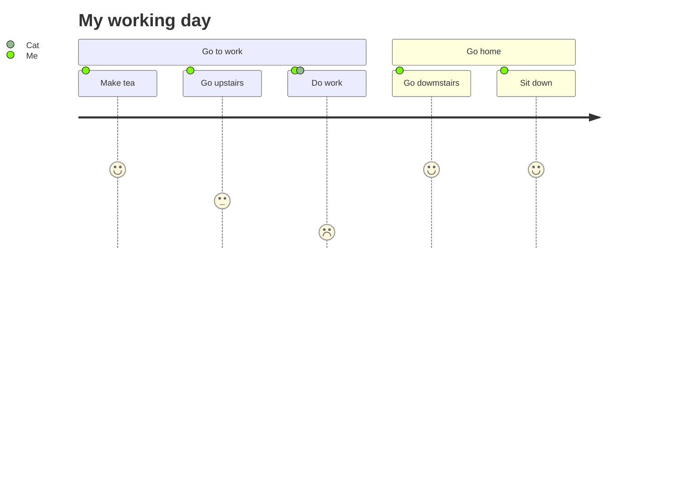
```mermaid
journey
    title My working day
    section Go to work
        Make tea: 5: Me
        Go upstairs: 3: Me
        Do work: 1: Me, Cat
    section Go home
        Go dowmstairs: 5: Me
        Sit down: 5: Me
```

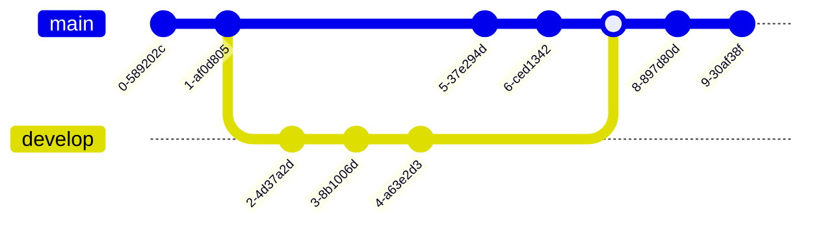
```mermaid
gitGraph
    commit
    commit
    branch develop
    commit
    commit
    commit
    checkout main
    commit
    commit
    merge develop
    commit
    commit
```

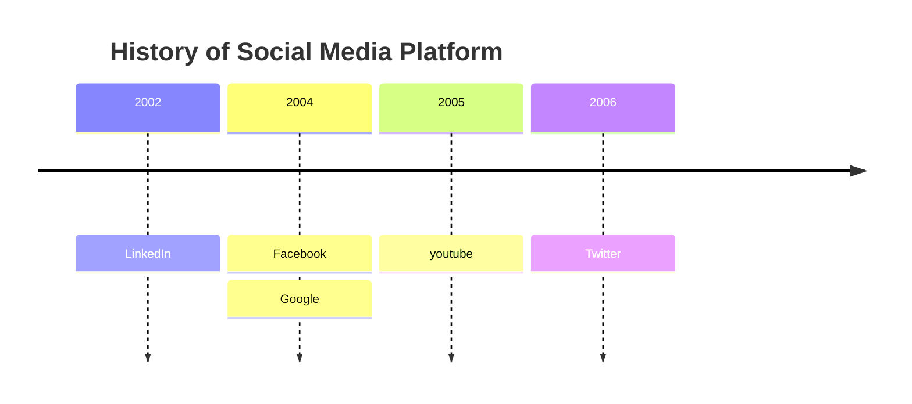
```mermaid
timeline
    title History of Social Media Platform
    2002: LinkedIn
    2004: Facebook: Google
    2005: youtube
    2006: Twitter
```

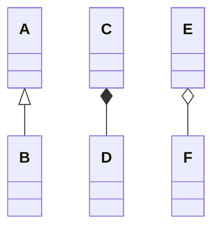
```mermaid
classDiagram
    A <|-- B 
    C *-- D
    E o-- F

```

